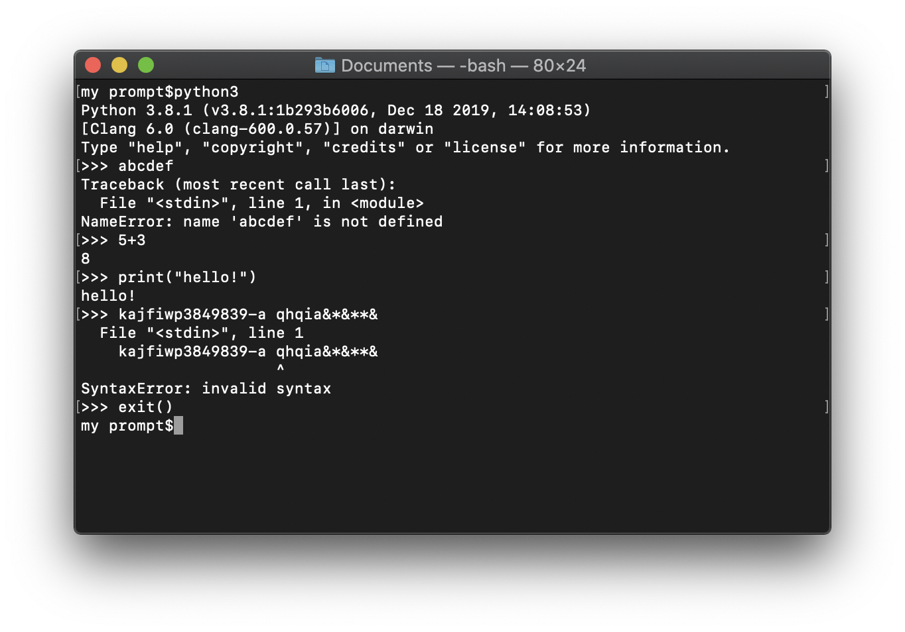

# computer_literacy

Notes on computer literacy lessons

# Overview

**Vision**  Knowledge of circuits and computer science is ubiquitous as reading and writing.

# Topics
Lesson Plans + Notes from instructor led sessions

## Kinder (2019/2020)
* [Keyboarding / Typing](./typing.md)
* [Circuits](./circuits.md)
* [Computer Science](./computer_science.md)

# Background

I have a professional background in engineering, and volunteer experience in youth sports and being a first responder.   I am interested in my children and our community having opportunities to experience and learn about technology to enable them to make decisions about its place in their life.   Starting in 2019, I started to learn about applying computer literacy to kinder aged children.

# Resources

Quick links to resources found to be helpful or of interest, characterized as **begineer**, **intermediate** or **advanced**.

## Created Resources

Resources I have created to help learn about cirriculum and communicate to others.

* [clever.com quick reference](https://docs.google.com/document/d/1qtMP3LzquHEirfda712Foy8iN9O0yexxkMmN1kxkFEg/edit?usp=sharing) is a document I made to communicate how [SCUSD](https://www.scusd.edu/) students can use the clever.com login to access code.org and typing.com resources.
* [Bear Bot](https://studio.code.org/projects/applab/pLba-GGaMFFM-1QfC2RRLMQfEgiujXZG4f_BU7r1kss) is a code.com App project I created as a mock-up of what an App to control a robot could look like.  

## External Resources

* [tapkins](https://tapkins.com/) A Fun English Learning & Spelling App for Kids Aged 4-6 years and of all Learning Abilities.
* [code.org](https://code.org/) **Beginner** to **Advanced**
    * Downloadable Informational [Brochure](https://www.dropbox.com/s/ivrnloivh7ygpwr/csfadminbrochure2019.pdf?dl=0)
* https://www.python.org/ **Begineer** to **Advanced**
    * Okay, out of the box, this is not a begineer topic.  But if you are on a desktop computer, chances are python is [installed](https://www.dummies.com/programming/python/write-a-simple-program-in-python/) and one way to expose children to computers is to let them `type`.  Why not let them `type` at a `python console`? 
* Robotics
   * https://www.firstinspires.org/
   * http://www.juniorfirstlegoleague.org/

Have yet to try:

* https://codecombat.com/
* https://arcade.academy/
